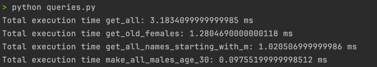

### MongoDB

1. Сервер был развернут с помощью докера, пример в репозитории
2. Для исследования выбран и [загружен](import_titanic.py) датасет Титаник
3. [Запросы](queries.py) для анализа:
   * Получение всех данных: get_all()
   * Получение всех девушек старше 30: get_old_females()
   * Получение всех пассажиров с именем на "М": get_all_names_starting_with_m()
   * Ограничение сверху возраста всех мужчин старше 30: make_all_males_age_30()
   * Результаты 
   * 
   * Измеряется среднее время за 1000 запусков
4. Добавим индексы на возраст, пол и имя
   * 
   * Видно ускорение в 1.5 - 5 раз!